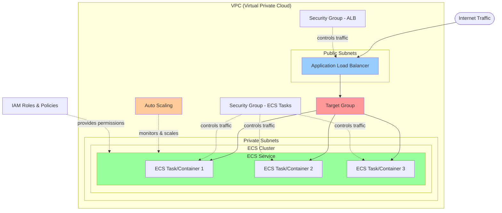

```mermaid
graph TB
Internet([Internet Traffic])

subgraph VPC["VPC (Virtual Private Cloud)"]
subgraph PublicSubnets["Public Subnets"]
ALB[Application Load Balancer]
end

subgraph PrivateSubnets["Private Subnets"]
subgraph ECSCluster["ECS Cluster"]
subgraph ECSService["ECS Service"]
Task1[ECS Task/Container 1]
Task2[ECS Task/Container 2]
Task3[ECS Task/Container 3]
end
end
end

TG[Target Group]
ASG[Auto Scaling]
SG1[Security Group - ALB]
SG2[Security Group - ECS Tasks]
end

IAM[IAM Roles & Policies]

Internet --> ALB
ALB --> TG
TG --> Task1
TG --> Task2
TG --> Task3
ASG -.monitors & scales.-> ECSService
SG1 -.controls traffic.-> ALB
SG2 -.controls traffic.-> Task1
SG2 -.controls traffic.-> Task2
SG2 -.controls traffic.-> Task3
IAM -.provides permissions.-> ECSService

style TG fill:#ff9999
style ALB fill:#99ccff
style ECSService fill:#99ff99
style ASG fill:#ffcc99
```